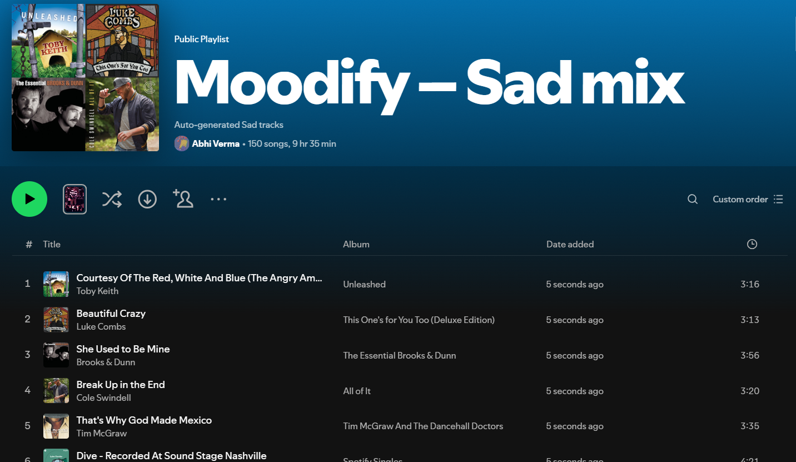

# Moodify 🎧
*Turn a gigantic 1 000‑track playlist into mood‑specific mixes with a single command.*



I built **Moodify** after realising some of my playlists had become musical soups. Searching for chill study music meant endless skips past dance bangers, and vice‑versa. By learning **your** mood labels from the playlists you already keep (Happy, Sad, Energetic, Calm—or any words you like), Moodify trains a compact neural net and then auto‑filters any playlist or CSV into fresh, mood‑pure playlists right inside your Spotify account.

---

## Table of Contents
1. [Features](#features)
2. [Installation](#installation)
3. [Quick Start](#quick-start)
4. [Command Reference](#command-reference)
5. [How It Works](#how-it-works)

---

## Features
- **Personalised model** – learns mood boundaries from *your* labelled playlists, not an off‑the‑shelf dataset.
- **Flexible sources** – filter a live Spotify playlist *or* an offline CSV of tracks.
- **Fast training** – 64‑32‑Softmax MLP reaches ~75 % macro F1 in < 30 s on CPU.
- **One‑line curation** – `moodify curate Happy --playlist …` → new playlist in your library.
- **Typer CLI** – clear `--help`, auto‑completion.

---

## Installation
```bash
# Clone and enter the repo
 git clone https://github.com/abhiverma13/Moodify.git
 cd Moodify

# Create and activate a virtual environment (Windows example)
 python -m venv .venv && .venv\Scripts\activate

# Install dependencies and the editable CLI
 pip install -r requirements.txt
 pip install -e .

# Add Spotify credentials
 cp .env.example .env        # then paste CLIENT_ID, CLIENT_SECRET, REDIRECT_URI
```
> **Spotify setup**  – create a developer app at <https://developer.spotify.com/dashboard>, add `http://127.0.0.1:8888/callback` as a Redirect URI, and copy the keys into `.env`.

---

## Quick Start
```bash
# 1 – list playlists (opens browser for OAuth on first run)
 moodify playlists

# 2 – build a dataset from the four standard mood words
 moodify build-dataset Happy Sad Energetic Calm --out data/train.csv

# 3 – train for 25 epochs and save weights
 moodify train data/train.csv --save model/moodnet.keras

# 4 – curate a playlist you already own into a Calm‑only mix
 moodify curate Calm \
        --playlist spotify:playlist:37i9dQZF1DX4WYpdgoIcn6 \
        --name "Calm Auto‑Mix"

# 5 – or filter an offline CSV you scraped elsewhere
 moodify curate Sad --csv data/test_clean.csv --public false
```

### CLI help example
```bash
moodify --help
moodify build-dataset --help
```
Each command prints usage, arguments, options, and examples.

---

## Command Reference
| Command | Purpose | Key flags |
|---------|---------|-----------|
| `moodify playlists` | List your playlists; add `--mine` to show only those you own. | — |
| `moodify build-dataset` | Harvest tracks from playlists whose **titles** contain given words; outputs labelled CSV. | `--out` |
| `moodify train` | Fit NN on CSV, print train & val scores. | `--epochs`, `--save` |
| `moodify curate` | Create a new playlist containing only tracks whose predicted mood matches. | `--playlist` **or** `--csv`, `--name`, `--public`, `--model-path` |

---

## How It Works
1. **Harvest playlists → dataset**  – Spotipy pulls 10 audio features per track; playlist title supplies the mood label.
2. **Pre‑process**  – `MinMaxScaler` normalises features, `LabelEncoder` integer‑encodes labels.
3. **Train / validate**  – 80 % / 20 % split, Keras MLP trains in seconds; detailed classification reports are shown.
4. **Persist**  – model saved as `.keras` plus `.meta` pickle holding scaler & encoder.
5. **Predict & curate**  – MoodNet predicts each track, Curator keeps only those matching your target mood, then uses Spotify Web API to create the mix.

Happy listening!