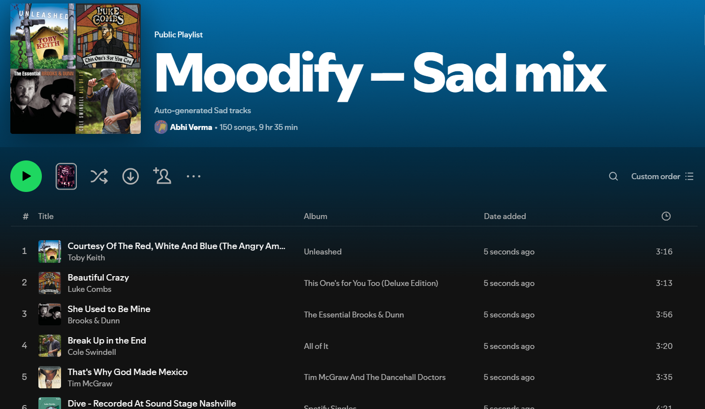

# Moodify 🎧

### *Turn a gigantic 1,000‑track playlist into mood‑specific mixes with a single command.*




---

I built **Moodify**, a CLI tool, after realising some of my playlists had become musical soups. Searching for chill
study music meant endless skips past dance bangers, and vice‑versa.

Moodify learns **your** mood labels from the playlists you already keep (Happy, Sad, Energetic, Calm, or any words
you like), trains a compact neural network on each track's Spotify audio features, and then auto‑filters any playlist
or CSV into fresh, mood‑pure playlists right inside your Spotify account.

```
your mood playlists ──► labelled dataset ──► MoodNet (Keras MLP) ──► predict each track ──► new Spotify playlist
```

---

## Table of Contents
1. [Features](#features)
2. [Installation](#installation)
3. [Quick Start](#quick-start)
4. [Command Reference](#command-reference)
5. [How It Works](#how-it-works)
6. [Project Structure](#project-structure)

---

## Features

| | |
|---|---|
| 🎯 **Personalised model** | Learns mood boundaries from *your* labelled playlists, not an off‑the‑shelf dataset. |
| 🔀 **Flexible sources** | Filter a live Spotify playlist *or* an offline CSV of tracks. |
| ⚡ **Fast training** | 64‑32‑Softmax MLP reaches ~75% macro F1 in under 30 s on CPU. |
| 🪄 **One‑line curation** | `moodify curate Happy --playlist …` → a new playlist in your library. |
| 🖥️ **Typer CLI** | Clear `--help` for every command, plus shell auto‑completion. |

---

## Installation

**Requirements:** Python 3.9+ and a Spotify account.

```bash
# Clone and enter the repo
git clone https://github.com/abhiverma13/Moodify.git
cd Moodify

# Create and activate a virtual environment (Windows example)
python -m venv .venv && .venv\Scripts\activate
# macOS / Linux: python -m venv .venv && source .venv/bin/activate

# Install dependencies and the editable CLI
pip install -r requirements.txt
pip install -e .

# Add Spotify credentials
cp .env.example .env        # then paste CLIENT_ID, CLIENT_SECRET, REDIRECT_URI
```

> [!NOTE]
> **Spotify setup:** create a developer app at <https://developer.spotify.com/dashboard>, add
> `http://127.0.0.1:8888/callback` as a Redirect URI, and copy the keys into `.env`.

---

## Quick Start

```bash
# 1 – list playlists (opens browser for OAuth on first run)
moodify playlists

# 2 – build a dataset from the four standard mood words
moodify build-dataset Happy Sad Energetic Calm --out data/train.csv

# 3 – train for 25 epochs and save weights
moodify train data/train.csv --save model/moodnet.keras

# 4 – curate a playlist you already own into a Calm‑only mix
moodify curate Calm \
       --playlist spotify:playlist:37i9dQZF1DX4WYpdgoIcn6 \
       --name "Calm Auto‑Mix"

# 5 – or filter an offline CSV you scraped elsewhere
moodify curate Sad --csv data/test_clean.csv --public false
```

> [!TIP]
> Want to skip steps 2–3? A trained model (`model/moodnet.keras` + `model/moodnet.meta`) and the training data
> (`data/train.csv`) are included in the repo, so you can go straight to `moodify curate`.

### CLI help example
```bash
moodify --help
moodify build-dataset --help
```
Each command prints usage, arguments, options, and examples.

---

## Command Reference

| Command | Purpose | Key flags |
|---------|---------|-----------|
| `moodify playlists` | List your playlists; add `--mine` to show only those you own. | — |
| `moodify build-dataset` | Harvest tracks from playlists whose **titles** contain the given words; outputs a labelled CSV. | `--out` |
| `moodify train` | Fit the neural network on a CSV and print train & validation scores. | `--epochs`, `--save` |
| `moodify curate` | Create a new playlist containing only tracks whose predicted mood matches. | `--playlist` **or** `--csv`, `--name`, `--public`, `--model-path` |

---

## How It Works

1. **Harvest playlists → dataset.** Spotipy pulls 10 audio features per track (acousticness, danceability, energy,
   instrumentalness, liveness, loudness, speechiness, tempo, valence, duration); the playlist title supplies the mood
   label.
2. **Pre‑process.** `MinMaxScaler` normalises features to [0, 1] and `LabelEncoder` integer‑encodes labels.
3. **Train / validate.** A stratified 80% / 20% split; the Keras MLP (Dense 64 → Dense 32 → Softmax, Adam optimiser)
   trains in seconds and prints detailed classification reports for both sets.
4. **Persist.** The model is saved as `.keras`, plus a `.meta` pickle holding the scaler & encoder so predictions use
   exactly the same preprocessing.
5. **Predict & curate.** MoodNet predicts each track's mood, the Curator keeps only those matching your target mood,
   then uses the Spotify Web API to create the mix.

The included model was trained on ~1,750 tracks from my own playlists across four moods: Calm, Happy, Sad and
Energetic.

---

## Project Structure

```
Moodify/
├── moodify/
│   ├── cli.py           # Typer commands: playlists, build-dataset, train, curate
│   ├── auth.py          # Spotify OAuth (PKCE) with token caching
│   ├── client.py        # Spotify API session wrapper
│   ├── data.py          # Track + audio-feature extraction, dataset building
│   ├── model.py         # MoodNet: scaling, encoding, Keras MLP, save/load
│   └── recommender.py   # Curator: filters tracks by predicted mood
├── model/               # Trained MoodNet weights (.keras) + preprocessing (.meta)
├── data/                # Labelled training set and a test playlist
├── requirements.txt
└── pyproject.toml       # Installs the `moodify` console command
```

---

**Happy listening!** 🎶